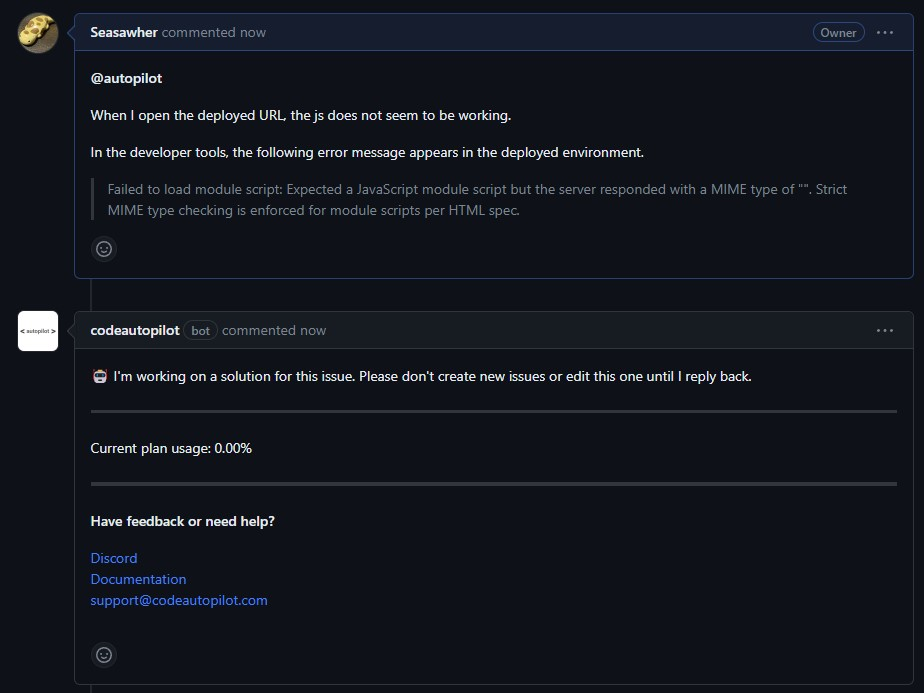

+++
title = "リポジトリを読み込んで issue の解決策を考えてくれるAI"
date = 2023-09-26
draft = false

[taxonomies]
tags = ["development", "GPT", "AI", "product-hunt"]

[extra]
+++

GitHub Marketplace を眺めていたら，[Code Autopilot](https://github.com/marketplace/code-autopilot-ai-coder) というアプリが登場していました．説明文曰く，GitHub のリポジトリを読み込んで，issue に対して解決策をコード付きで示してくれるようです．どんな感じなのか，早速使ってみます．

## issue について

何をお願いするかが問題ですが，ちょうど解決してほしい issue があります．最近 [Conway's Life Game を Deno + TypeScript + p5.js で実装するという試み](https://github.com/Seasawher/game-of-life)をしたのですが，ローカルでは動作するのにデプロイ先で動作しないという問題で困っていて，現在も解決していないのでこれについてコメントしてもらうことにします．

Deno の Discord サーバで相談して PR まで作っていただいたのにダメだったので，おそらく難しい問題だと思います．これが解決出来たらかなりすごいですよ．

## 使用方法

リポジトリを選択してインストール．その後，issue を作成して `@autopilot` とメンションすればいいだけのようです．簡単でありがたいですね．

次のように，リプライが現れて読み込み中になります．

## 回答内容

数分後，次のような回答が返ってきました．

The error message you're seeing suggests that the server is not serving JavaScript files with the correct MIME type. This could be due to the server configuration on the platform where you deployed your application.

The script tag in your `index.html` file seems to be correctly set with the type attribute as 'module'. The source of the script is also correctly pointing to '/src/index.tsx'. However, the issue might be with the server not being able to correctly serve the JavaScript module script. The server should respond with a MIME type of 'application/javascript' for JavaScript module scripts.

Unfortunately, there's nothing we can do in the `vite.config.ts` file to solve the issue. This file is currently empty, which means that it's using Vite's default configuration.

Here are the steps you can take to solve this issue:

1. Check the server configuration on your deployment platform and ensure that JavaScript files are being served with the correct MIME type (`application/javascript` or `text/javascript` for older browsers).

2. If you're using Deno Deploy, it should handle this automatically. If it doesn't, it might be a bug on their side, and you should report it to them.

3. If you're serving your application with a custom server, you might need to add a specific configuration to serve JavaScript files with the correct MIME type.

4. Also, make sure that your JavaScript files have the `.js` extension, as some servers use the file extension to determine the MIME type.

Remember, the issue is not in your `index.html` or `vite.config.ts` files but likely in the server configuration. You should check the server configuration and the way the JavaScript files are being served.

  
Changes on index.html

  The script tag in this file seems to be correctly set with the type attribute as 'module'. The source of the script is also correctly pointing to '/src/index.tsx'.

However, the issue might be with the server not being able to correctly serve the JavaScript module script. The server should respond with a MIME type of 'application/javascript' for JavaScript module scripts.

This issue is not in this file but likely in the server configuration. You should check the server configuration and the way the JavaScript files are being served.

  
Changes on vite.config.ts

  The `vite.config.ts` file is currently empty, which means that it's using Vite's default configuration.

The error message you're seeing suggests that the server is not serving JavaScript files with the correct MIME type. This could be due to the server configuration on the platform where you deployed your application.

Unfortunately, there's nothing we can do in this file to solve the issue. You should check the server configuration on your deployment platform and ensure that JavaScript files are being served with the correct MIME type (`application/javascript` or `text/javascript` for older browsers).

If you're using Deno Deploy, it should handle this automatically. If it doesn't, it might be a bug on their side, and you should report it to them.

If you're serving your application with a custom server, you might need to add a specific configuration to serve JavaScript files with the correct MIME type.

Also, make sure that your JavaScript files have the `.js` extension, as some servers use the file extension to determine the MIME type.

結局解決策が書かれていないのですが，この解答はかなり良いのではないかと思います．コードに問題はないと思うから Deno Deploy のバグまたはサーバの設定ミスではないかと提案してくれているのですが，なるほどと思わされました．

かなり有用そうなので，個人的にまた使ってみます．月に 10 issue まで無料で使えるみたいなので，かなり役に立つのではと思います．
