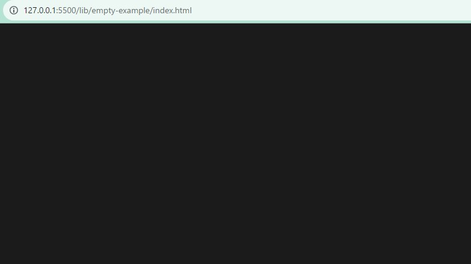
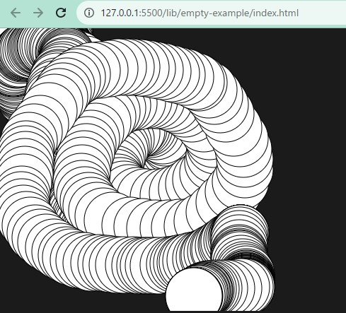

+++
title = "p5.js をローカルにインストールする"
date = 2023-09-23
draft = false

[taxonomies]
tags = ["p5.js", "setup"]

[extra]
+++

p5.js を触ってみたくなったので環境構築をします．公式は Web Editor を使うことをお勧めしているのですが，今回は後でカスタマイズしたい都合上ローカルで環境構築をします．

## ダウンロード
まず p5.js complete をダウンロードします．[ダウンロードページ](https://p5js.org/download/) からダウンロードできます．`.zip` ファイルがダウンロードされるので，解凍して適当な場所に再配置します．

## VSCode のセットアップ
インストールが終わったら，今度はローカルサーバの用意です．説明が[このページ](https://github.com/processing/p5.js/wiki/Local-server)にあります．エディタごとに説明が異なりますが，今回はVSCodeを選択します．LiveServer 拡張機能をインストールし，指示に従って LiveServer のテストをします．

ダウンロードした p5 プロジェクトを VSCode で開いて，`empty-exmaple` を LiveServer で開けばよいでしょう．何もない画面が表示されます．



さらにお勧めされている p5.vscode拡張機能 `samplavigne.p5-vscode` もインストールしておきます．

## テスト

挙動をテストしてみましょう．`sketch.js` に次のようなコードを貼り付けます．

```js
function setup() {
  createCanvas(400, 400);
}

function draw() {
  if (mouseIsPressed) {
    fill(0);
  } else {
    fill(255);
  }
  ellipse(mouseX, mouseY, 80, 80);
}
```

そして，LiveServer で表示された画面をチェックしてみます．マウスを重ねた位置に円が描画されるようになっていればOKです．


